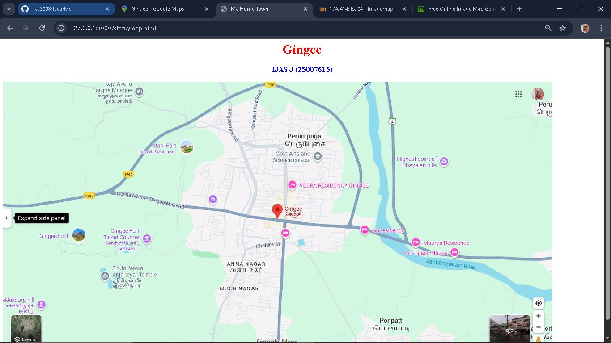
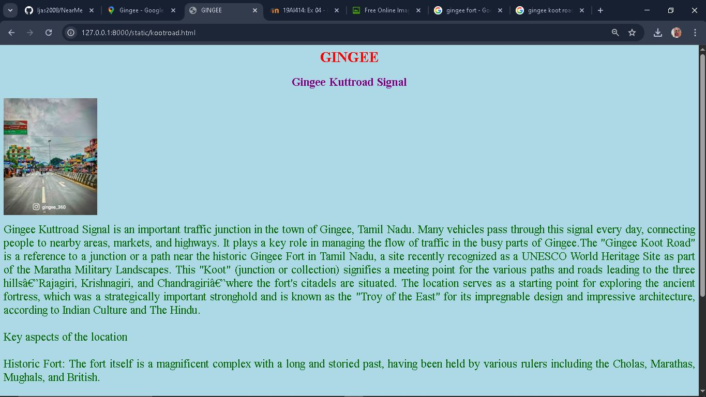
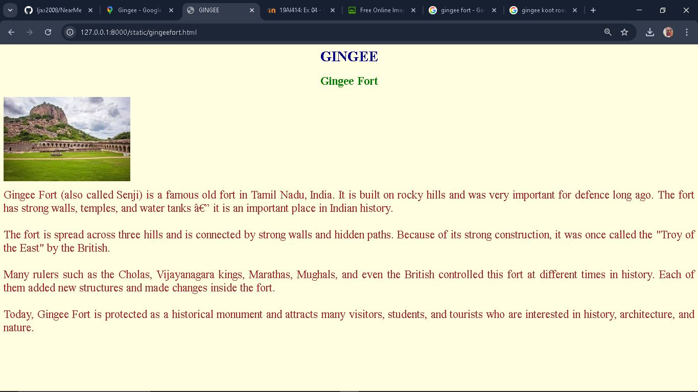
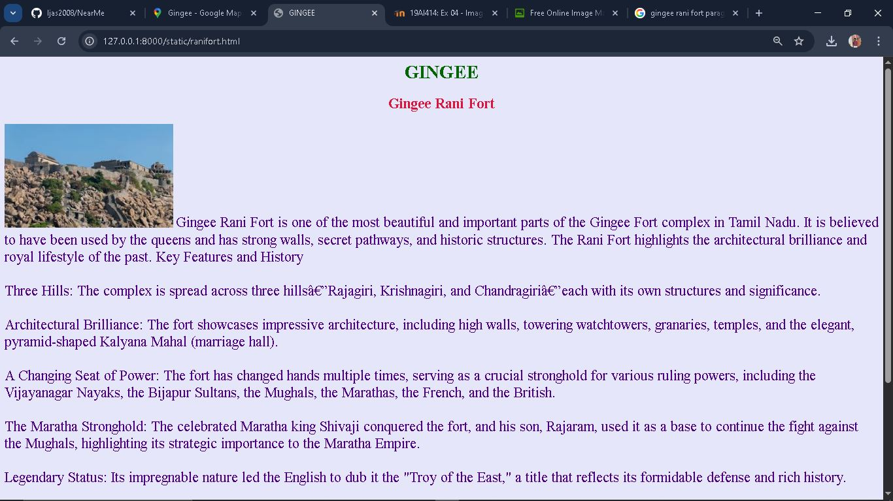
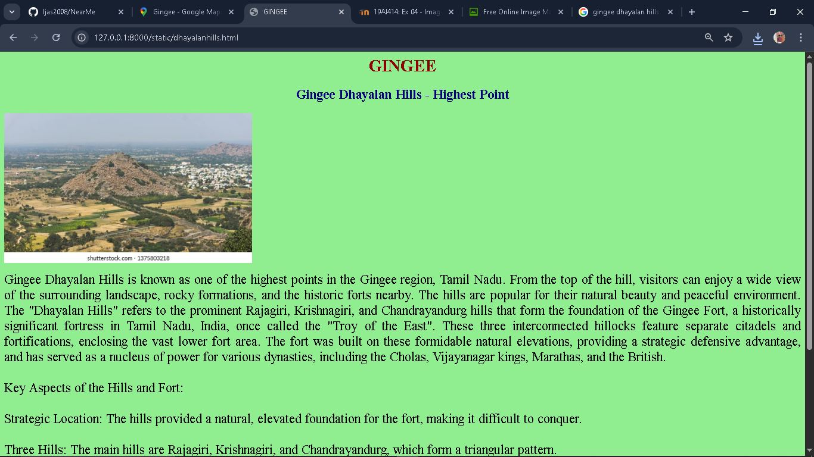

# Ex04 Places Around Me
## Date: 28.09.2025

## AIM
To develop a website to display details about the places around my house.

## DESIGN STEPS

### STEP 1
Create a Django admin interface.

### STEP 2
Download your city map from Google.

### STEP 3
Using ```<map>``` tag name the map.

### STEP 4
Create clickable regions in the image using ```<area>``` tag.

### STEP 5
Write HTML programs for all the regions identified.

### STEP 6
Execute the programs and publish them.

## CODE
```
map.html

<html>
    <head>
        <title>
            My Home Town
        </title>
    </head>
    <body>
        <h1 align="center">
            <font color="red"><b>Gingee</b></font>
        </h1>    
        <h3 align="center">
            <font color="blue"><b>IJAS J (25007615)</b></font>
        </h3>
            

<map name="image-map">
    <area target="" alt="GINGEE FORT" title="GINGEE FORT" href="gingeefort.html" coords="73,356,232,404" shape="rect">
    <area target="" alt="GINGEE KUTTROAD" title="GINGEE KUTTROAD" href="kootroad.html" coords="698,344,53" shape="circle">
    <area target="" alt="GOVT ARTS AND SCIENCE CLG" title="GOVT ARTS AND SCIENCE CLG" href="govtclg.html" coords="658,164,792,164,812,184,795,212,660,211" shape="poly">
    <area target="" alt="DHAYALAN HILLS" title="DHAYALAN HILLS" href="dhayalanhills.html" coords="1093,199,120" shape="circle">
    <area target="" alt="RANI FORT" title="RANI FORT" href="ranifort.html" coords="328,133,483,194" shape="rect">
</map>
    </body>
</html>

gingeefort.html

<html>
<head>
  <title>GINGEE </title>
</head>
<body bgcolor="lightyellow">

  <h1 align="center">
    <font color="darkblue">GINGEE</font>
  </h1>

  <h2 align="center">
    <font color="green">Gingee Fort</font>
  </h2>
    
  <p align="justify">
  <font color="brown" size="5">
    Gingee Fort (also called Senji) is a famous old fort in Tamil Nadu, India.
    It is built on rocky hills and was very important for defence long ago.
    The fort has strong walls, temples, and water tanks — it is an important
    place in Indian history.<br><br>

    The fort is spread across three hills and is connected by strong walls and
    hidden paths. Because of its strong construction, it was once called the
    "Troy of the East" by the British.<br><br>

    Many rulers such as the Cholas, Vijayanagara kings, Marathas, Mughals,
    and even the British controlled this fort at different times in history.
    Each of them added new structures and made changes inside the fort.<br><br>

    Today, Gingee Fort is protected as a historical monument and attracts
    many visitors, students, and tourists who are interested in history,
    architecture, and nature.
  </font>
</p>


</body>
</html>

kootroad.html

<html>
<head>
  <title>GINGEE</title>
</head>
<body bgcolor="lightblue">

  <h1 align="center">
    <font color="red">GINGEE</font>
  </h1>

  <h2 align="center">
    <font color="purple">Gingee Kuttroad Signal</font>
  </h2>
  

  <p align="justify">
    <font color="darkgreen" size="5">
      Gingee Kuttroad Signal is an important traffic junction in the town of Gingee,
      Tamil Nadu. Many vehicles pass through this signal every day, connecting people
      to nearby areas, markets, and highways. It plays a key role in managing the flow
      of traffic in the busy parts of Gingee.The "Gingee Koot Road" is a reference to a junction or a path near the historic Gingee Fort in Tamil Nadu, a site recently recognized as a UNESCO World Heritage Site as part of the Maratha Military Landscapes. This "Koot" (junction or collection) signifies a meeting point for the various paths and roads leading to the three hills—Rajagiri, Krishnagiri, and Chandragiri—where the fort's citadels are situated. The location serves as a starting point for exploring the ancient fortress, which was a strategically important stronghold and is known as the "Troy of the East" for its impregnable design and impressive architecture, according to Indian Culture and The Hindu. <br></br> 
Key aspects of the location<br></br>
Historic Fort: The fort itself is a magnificent complex with a long and storied past, having been held by various rulers including the Cholas, Marathas, Mughals, and British. <br></br>
Architectural Marvel: The fort's strategic layout on three hills, its impressive fortifications, and historical structures like the Kalyana Mahal highlight its architectural brilliance.<br></br> 
Cultural Significance: Its inclusion in the Maratha Military Landscapes UNESCO World Heritage Site brings global recognition to the site's historical importance and the cultural heritage it represents. <br></br>
Tourist Attraction: Today, the area around the Gingee Koot Road serves as a gateway for visitors to explore the fort, hike to its various levels, and witness the remnants of its grand past, as noted by Tripadvisor.<br></br> 
    </font>
  </p>

</body>
</html>

govtclg.html

<html>
<head>
  <title>GINGEE</title>
</head>
<body bgcolor="lightpink">

  <h1 align="center">
    <font color="blue">GINGEE</font>
  </h1>

  <h2 align="center">
    <font color="orange">Gingee Govt. Arts and Science College</font>
  </h2>

  <p align="justify">
    <font color="maroon" size="5">
      Gingee Government Arts and Science College is an important educational institution
      in the town of Gingee, Tamil Nadu. The college offers a variety of courses in arts,
      science, and other fields, providing quality education to students from nearby areas.
      It plays a key role in improving higher education opportunities for the local community.
      However, Tamil Nadu has a network of state-run and affiliated colleges offering arts and science programs. Colleges like G.P. Arts and Science College are located in Gingee, offering various undergraduate courses such as B.Com, B.Sc. Computer Science, and B.Sc. Mathematics, alongside diploma programs, to serve students in the region's educational landscape.
About Gingee's Educational Institutions<br></br>
G.P. Arts and Science College: This institution provides a diverse range of undergraduate courses, with popular programs including B.Com, B.Sc. Computer Science, B.Sc. Mathematics, and B.Sc. Physics. It also offers diploma courses.<br></br>
Focus on Regional Needs: Such colleges are crucial for providing higher education opportunities to students in the surrounding areas, aligning with the overall growth of state-run colleges in Tamil Nadu. <br></br>
Admissions: Prospective students can often find detailed information on their websites, and the admission process for government colleges is typically managed through the Tamil Nadu government's official portals. <br></br>
Affiliation: G.P. Arts and Science College is affiliated with Annamalai University, a renowned institution based in Cuddalore, which ensures its academic standards and curriculum align with state-wide educational frameworks. <br></br>
    </font>
  </p>

</body>
</html>

dhayalanhills.html

<html>
<head>
  <title>GINGEE</title>
</head>
<body bgcolor="lightgreen">

  <h1 align="center">
    <font color="darkred">GINGEE</font>
  </h1>

  <h2 align="center">
    <font color="navy">Gingee Dhayalan Hills - Highest Point</font>
  </h2>

  <p align="justify">
    <font color="black" size="5">
      Gingee Dhayalan Hills is known as one of the highest points in the Gingee region,
      Tamil Nadu. From the top of the hill, visitors can enjoy a wide view of the
      surrounding landscape, rocky formations, and the historic forts nearby.
      The hills are popular for their natural beauty and peaceful environment.
      The "Dhayalan Hills" refers to the prominent Rajagiri, Krishnagiri, and Chandrayandurg hills that form the foundation of the Gingee Fort, a historically significant fortress in Tamil Nadu, India, once called the "Troy of the East". These three interconnected hillocks feature separate citadels and fortifications, enclosing the vast lower fort area. The fort was built on these formidable natural elevations, providing a strategic defensive advantage, and has served as a nucleus of power for various dynasties, including the Cholas, Vijayanagar kings, Marathas, and the British.  <br></br>
Key Aspects of the Hills and Fort:<br></br>
Strategic Location: The hills provided a natural, elevated foundation for the fort, making it difficult to conquer. <br></br>
Three Hills: The main hills are Rajagiri, Krishnagiri, and Chandrayandurg, which form a triangular pattern. <br></br>
Fortifications: A large rampart and moat surround the complex, while individual walls connect the hills, creating a self-contained defensive system. <br></br>
Historical Significance: The fort complex represents a rich history, with each hill containing its own citadel and various structures like temples, mosques, granaries, and halls. <br></br>
Kalyana Mahal: A notable structure, the seven-storeyed marriage hall (Kalyana Mahal) is located within the fort complex. <br></br>
    </font>
  </p>

</body>
</html>

ranifort.html

<html>
<head>
  <title>GINGEE</title>
</head>
<body bgcolor="lavender">

  <h1 align="center">
    <font color="darkgreen">GINGEE</font>
  </h1>

  <h2 align="center">
    <font color="crimson">Gingee Rani Fort</font>
  </h2>

    <font color="indigo" size="5">
      Gingee Rani Fort is one of the most beautiful and important parts of the Gingee Fort
      complex in Tamil Nadu. It is believed to have been used by the queens and has
      strong walls, secret pathways, and historic structures. The Rani Fort highlights
      the architectural brilliance and royal lifestyle of the past.
      Key Features and History<br
Strategic Location: The fort position on hills overlooking the eastern ghats was strategically vital, controlling profitable trade routes and allowing it to fend off invading armies. <br></br>
Three Hills: The complex is spread across three hills—Rajagiri, Krishnagiri, and Chandragiri—each with its own structures and significance. <br></br>
Architectural Brilliance: The fort showcases impressive architecture, including high walls, towering watchtowers, granaries, temples, and the elegant, pyramid-shaped Kalyana Mahal (marriage hall). <br></br>
A Changing Seat of Power: The fort has changed hands multiple times, serving as a crucial stronghold for various ruling powers, including the Vijayanagar Nayaks, the Bijapur Sultans, the Mughals, the Marathas, the French, and the British. <br></br>
The Maratha Stronghold: The celebrated Maratha king Shivaji conquered the fort, and his son, Rajaram, used it as a base to continue the fight against the Mughals, highlighting its strategic importance to the Maratha Empire. <br></br>
Legendary Status: Its impregnable nature led the English to dub it the "Troy of the East," a title that reflects its formidable defense and rich history. <br></br>
Why Visit<br></br>  
Historical Immersion: Explore a site that was a center of power for centuries and witnessed major historical events. <br></br>
Architectural Marvels: Discover the unique architectural features, including the water supply system and the well-preserved Kalyana Mahal.<br></br> 
Panoramic Views: Enjoy breathtaking views of the surrounding landscape from the high vantage points of the fort's towers. <br></br>
    </font>
  </p>

</body>
</html>

```

## OUTPUT







## RESULT
The program for implementing image maps using HTML is executed successfully.
